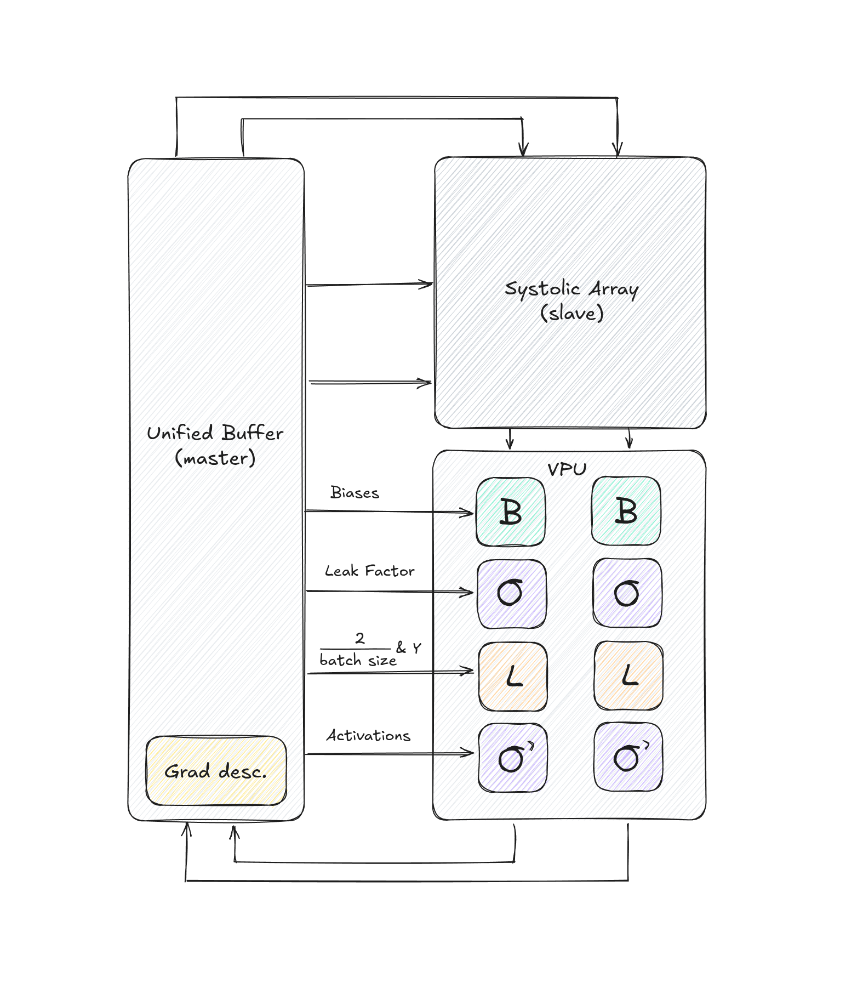

# tiny-tpu

A minimal tensor processing unit (TPU), reinvented from Google's TPU V2 and V1.


https://github.com/user-attachments/assets/b5d6aefe-4250-4c6d-866e-65d519e4de74


## Table of Contents

- [Motivation](#motivation)
- [Architecture](#architecture)
  - [Processing Element (PE)](#processing-element-pe)
  - [Systolic Array](#systolic-array)
  - [Vector Processing Unit (VPU)](#vector-processing-unit-vpu)
  - [Unified Buffer (UB)](#unified-buffer-ub)
  - [Control Unit](#control-unit)
- [Instruction Set](#instruction-set)
- [Example Instruction Sequence](#example-instruction-sequence)
- [Future Steps](#future-steps)
- [Setup](#setup)
  - [MacOS specific](#macos-specific)
  - [Ubuntu specific](#ubuntu-specific)
- [Adding a new module to the tiny-tpu](#adding-a-new-module-to-the-tiny-tpu)
  - [1. Create the module file](#1-create-the-module-file)
  - [2. Create the dump file](#2-create-the-dump-file)
  - [3. Create the test file](#3-create-the-test-file)
  - [4. Update the Makefile](#4-update-the-makefile)
  - [5. View waveforms](#5-view-waveforms)
- [Running commands from Makefile](#running-commands-from-makefile)
- [Fixed point viewing in gtkwave](#fixed-point-viewing-in-gtkwave)
- [What is a gtkw file?](#what-is-a-gtkw-file)

## Architecture



### Processing Element (PE)

- **Function**: Performs a multiply-accumulate operation every clock cycle
- **Data Flow**: 
  - Incoming data is multiplied by a stored weight and added to an incoming partial sum to produce an output sum
  - Incoming data also passes through to the next element for propagation across the array

### Systolic Array

- **Architecture**: A 2D grid of processing elements
- **Data Movement**:
  - Input values flow horizontally across the array
  - Partial sums flow vertically down the array
  - Weights remain fixed within each processing element during computation
- **Input Preprocessing**:
  - Input matrices are rotated 90 degrees (implemented in hardware)
  - Inputs are staggered for correct computation in the systolic array
  - Weight matrices are transposed and staggered to align with mathematical formulas

### Vector Processing Unit (VPU)

- Performs element-wise operations after the systolic array
- **Control**: Module selection depends on the computation stage
- **Modules (pipelined)**:
  1. Bias addition
  2. Leaky ReLU activation function
  3. MSE loss
  4. Leaky ReLU derivative

### Unified Buffer (UB)

- Dual-port memory for storing intermediate values
- **Stored Data**:
  - Input matrices
  - Weight matrices
  - Bias vectors
  - Post-activation values for backpropagation
  - Activation leak factors
  - Inverse batch size constant for MSE backpropagation
- **Interface**:
  - Two read and two write ports per data type
  - Data is accessed by specifying a start address and count
  - Reads can occur continuously in the background until the requested count is reached

### Control Unit

- **Instruction width**: 94 bits
- See [Instruction Set](#instruction-set) section below for more information.

## Instruction Set

Our ISA is 94 bits wide. The full image is available in the `images/` folder.

Our ISA defines all necessary signals for transferring data and interacting with our TPU. The implementation of the control unit (which reads instructions) can be found at `src/control_unit.sv`.

The `instruction` bus is **94 bits wide** (`[93:0]`) and is divided into fields that directly control subsystems.

### Bits [0–4]: 1-bit Control Signals

| Bit | Signal                  | Meaning                                           | Example                     |
|-----|-------------------------|---------------------------------------------------|-----------------------------|
| 0   | `sys_switch_in`         | System mode switch (general-purpose "on/off" CU)  | `1 = system active`, `0 = idle` |
| 1   | `ub_rd_start_in`        | Start UB (Unified Buffer) read transaction        | `1 = trigger read`, `0 = no read` |
| 2   | `ub_rd_transpose`       | UB read transpose mode                            | `1 = transpose`, `0 = normal` |
| 3   | `ub_wr_host_valid_in_1` | Host write channel 1 valid flag                   | `1 = write valid`, `0 = not valid` |
| 4   | `ub_wr_host_valid_in_2` | Host write channel 2 valid flag                   | `1 = write valid`, `0 = not valid` |

### Bits [6:5]: UB Read Column Size (2-bit)

| Field | Signal           | Meaning                          | Example                          |
|-------|------------------|----------------------------------|----------------------------------|
| [6:5] | `ub_rd_col_size` | Number of columns to read        | `00=0`, `01=1`, `10=2`, `11=3` |

### Bits [14:7]: UB Read Row Size (8-bit)

| Field  | Signal           | Meaning                       | Example                |
|--------|------------------|-------------------------------|------------------------|
| [14:7] | `ub_rd_row_size` | Number of rows to read (0–255) | `0x08 = read 8 rows` |

### Bits [22:15]: UB Read Address (8-bit)

| Field   | Signal          | Meaning                  | Example             |
|---------|-----------------|--------------------------|---------------------|
| [22:15] | `ub_rd_addr_in` | UB read address (0–255)  | `0x10 = read bank 16` |

### Bits [25:23]: UB Pointer Select (3-bit)

| Field   | Signal      | Meaning                   | Example                      |
|---------|-------------|---------------------------|------------------------------|
| [25:23] | `ub_ptr_sel` | Selects UB pointer       | `3’b001 = route read ptr to bias module in VPU` |

### Bits [41:26]: UB Write Host Data In 1 (16-bit, Fixed-Point)

| Field   | Signal                  | Meaning                  | Example |
|---------|-------------------------|--------------------------|---------|
| [41:26] | `ub_wr_host_data_in_1`  | First host write word     | `0xABCD` |

### Bits [57:42]: UB Write Host Data In 2 (16-bit, Fixed-Point)

| Field   | Signal                  | Meaning                  | Example |
|---------|-------------------------|--------------------------|---------|
| [57:42] | `ub_wr_host_data_in_2`  | Second host write word    | `0x1234` |

### Bits [61:58]: VPU Data Pathway (4-bit)

| Field   | Signal             | Meaning                       | Example                           |
|---------|--------------------|-------------------------------|-----------------------------------|
| [61:58] | `vpu_data_pathway` | Routing of data in VPU        | `0001=bias + relu routing` |

### Bits [77:62]: Inverse Batch Size × 2 (16-bit, Fixed-Point)

| Field   | Signal                        | Meaning                              | Example |
|---------|-------------------------------|--------------------------------------|---------|
| [77:62] | `inv_batch_size_times_two_in` | Precomputed scaling factor (2/batch) | `0x0010 = (2/32)` |

### Bits [93:78]: VPU Leak Factor (16-bit, Fixed-Point)

| Field   | Signal             | Meaning                        | Example |
|---------|--------------------|--------------------------------|---------|
| [93:78] | `vpu_leak_factor_in` | Leak factor for activation (e.g., Leaky ReLU) | `0x00A0 = 0.625` |

## Example Instruction Sequence

Instructions are directly loaded into an instruction buffer on the chip from a testbench file.

- See `tests/test_tpu.py` for our forward and backward pass instruction sequence
- See the [Setup](#setup) section on how to run this testbench 

## Future Steps

1. Compiler for this instruction set
2. Scaling TPU to larger dimensions (256×256 or 512×512)

## Setup

We are open source and appreciate any contributions! Here is our workflow and steps to set up our development environment:

### MacOS Specific

1. Create a virtual environment and run:
   ```bash
   pip install cocotb
   ```
2. Install iverilog using Homebrew:
   ```bash
   brew install iverilog
   ```
3. Build gtkwave **FROM SOURCE** (important: other installation methods currently do not work)

### Ubuntu/Linux Specific

1. Create a virtual environment and run:
   ```bash
   pip install cocotb
   ```
2. Install gtkwave:
   ```bash
   sudo apt install gtkwave
   ```
3. Install iverilog:
   ```bash
   sudo apt install iverilog
   ```

## Adding Modules

Follow these steps to add a new module to the project:

### 1. Create the Module File

Add your new module file `<MODULE_NAME>.sv` in the `src/` directory.

### 2. Create the Dump File

Create `dump_<MODULE_NAME>.sv` in the `test/` directory with the following code:

```systemverilog
module dump();
initial begin
  $dumpfile("waveforms/<MODULE_NAME>.vcd");
  $dumpvars(0, <MODULE_NAME>); 
end
endmodule
```

### 3. Creating Tests

Create `test_<MODULE_NAME>.py` in the `test/` directory.

### 4. Makefile Updates

Add your module to the `SOURCES` variable and create a test target:

```makefile
test_<MODULE_NAME>: $(SIM_BUILD_DIR)
	$(IVERILOG) -o $(SIM_VVP) -s <MODULE_NAME> -s dump -g2012 $(SOURCES) test/dump_<MODULE_NAME>.sv
	PYTHONOPTIMIZE=$(NOASSERT) MODULE=test_<MODULE_NAME> $(VVP) -M $(COCOTB_LIBS) -m libcocotbvpi_icarus $(SIM_VVP)
	! grep failure results.xml
	mv <MODULE_NAME>.vcd waveforms/ 2>/dev/null || true
```

### 5. View Waveforms

Run the following command to view the generated waveforms:

```bash
gtkwave waveforms/<MODULE_NAME>.vcd
```

## Makefile Commands

Run tests:
```bash
make test_<MODULE_NAME>
```
View waveforms:
```bash
gtkwave waveforms/<MODULE_NAME>.vcd
```

Or use the shorthand:
```bash
make show_<MODULE_NAME>
```

## GTKWwave Setup

1. Right-click all signals
2. Navigate to: **Data Format** → **Fixed Point Shift** → **Specify**
3. Enter `8` and click **OK**
4. Set: **Data Format** → **Signed Decimal**
5. Enable: **Data Format** → **Fixed Point Shift** → **ON**

## What is a .gtkw File?

A `.gtkw` file stores the signal configuration for `make show_<MODULE_NAME>`. You only need to save it once after running:
```bash
gtkwave waveforms/<MODULE_NAME>.vcd
```

## Motivation

The details of TPU architecture are closed source, as is most of chip design. We want this resource to be the ultimate guide to breaking into building chip accelerators for all levels of technical expertise — even if you just learned high school math and only know y = mx + b.

Before this project, none of us had professional experience in hardware architecture/design. We started this ambitious project as a dedicated group wanting to break into hardware design. We've collectively gained significant design experience from this project.

We hope that the inventive nature of the article at [tinytpu.com](https://tinytpu.com), this README, and the code in this repository will help you walk through our steps and learn how to approach problems with an inventive mindset.
